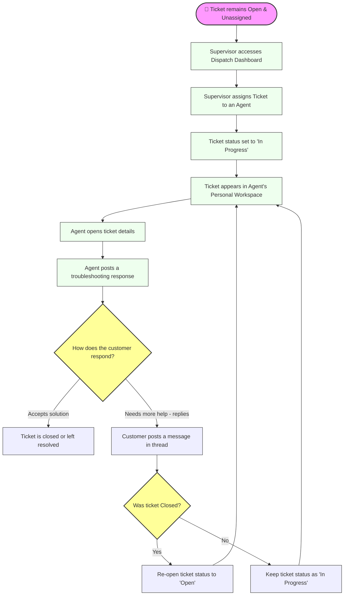
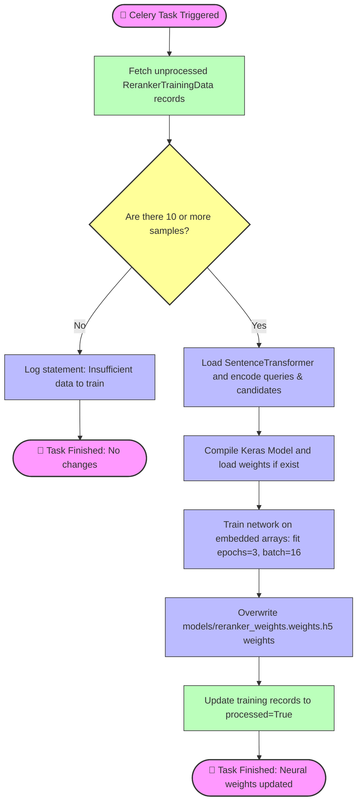

# Flow & Activity Diagrams for Ticketing System

This document contains **Mermaid flowcharts** outlining system activity, operations, and decision-making logic across the ticketing system.

---

## 🤖 1. End-to-End Ticket Processing, Triage, and RAG Decision Flow

This flowchart illustrates the complete decision tree executed when a customer opens a ticket. It details how the AI Triage classifies the ticket, how candidate retrieval is processed, and the conditions under which the system auto-resolves and closes a ticket.

```mermaid
graph TD
    %% Define styles for distinct elements
    classDef startEnd fill:#f9f,stroke:#333,stroke-width:2px;
    classDef decision fill:#ff9,stroke:#333,stroke-width:2px;
    classDef process fill:#bbf,stroke:#333,stroke-width:1px;
    classDef db fill:#bfb,stroke:#333,stroke-width:1px;
    classDef external fill:#fbb,stroke:#333,stroke-width:1px;

    %% Elements
    Start([🏁 Ticket Submitted]):::startEnd --> SaveTicket[Create Ticket & initial message in DB]:::process
    SaveTicket --> SignalTriage[Django post_save signal fired]:::process
    SignalTriage --> CallTriage[Request classification from moonshotai/kimi-k2.6]:::external
    
    CallTriage --> TriageOk{Is response valid JSON?}:::decision
    TriageOk -->|Yes| ParseTriage[Extract priority & explanation]:::process
    TriageOk -->|No| FallbackTriage[Assign 'Medium' priority and default explanation]:::process
    
    ParseTriage --> RefusalCheck{Refusal language detected?}:::decision
    RefusalCheck -->|Yes| ReplaceRefusal[Apply operational fallback explanation]:::process
    RefusalCheck -->|No| UpdateTriage[Write priority & explanation to Ticket]:::db
    ReplaceRefusal --> UpdateTriage
    FallbackTriage --> UpdateTriage
    
    %% RAG Pipeline
    UpdateTriage --> StartRAG[Start RAG Pipeline]:::process
    StartRAG --> CategoryCheck{Are there closed tickets in this category?}:::decision
    CategoryCheck -->|No| StopNoHistory([🏁 Skip RAG: Leave ticket Open for human agents]):::startEnd
    CategoryCheck -->|Yes| LoadCandidates[Retrieve up to 50 candidate tickets]:::db
    
    LoadCandidates --> EmbedTexts[Generate 384d vectors using SentenceTransformers]:::process
    EmbedTexts --> SimScore[Compute Cosine Similarity for each candidate]:::process
    
    SimScore --> WeightsCheck{Is custom reranker weights file present?}:::decision
    WeightsCheck -->|Yes| KerasScore[Run Concatenate + Dense Keras Model predictions]:::process
    WeightsCheck -->|No| BlendScore[Score = Cosine Similarity]:::process
    
    KerasScore --> BlendScore[Blend Score = max cosine, keras]:::process
    
    BlendScore --> TitleMatch{Do ticket titles match exactly?}:::decision
    TitleMatch -->|Yes| BoostScore[Boost Score to 0.95]:::process
    TitleMatch -->|No| SaveCandidates[Save retrieval scores in database]:::db
    BoostScore --> SaveCandidates
    
    SaveCandidates --> ThresholdCheck{Is highest candidate score >= 0.85?}:::decision
    ThresholdCheck -->|No| OpenHuman([🏁 Leave Ticket Open: Send to dispatch queue]):::startEnd
    ThresholdCheck -->|Yes| FetchResolution[Extract historical resolution message]:::db
    
    FetchResolution --> RewriteLLM[Call z-ai/glm-5.1 LLM to rewrite and anonymize]:::external
    RewriteLLM --> SaveResponse[Create message from 'ai_agent']:::db
    SaveResponse --> CloseTicket[Set Ticket status to 'Closed']:::db
    CloseTicket --> SaveTrainData[Add positive training pair to RerankerTrainingData]:::db
    SaveTrainData --> FinishedAuto([🏁 Ticket Closed: Auto-Resolved]):::startEnd
```

---

## 👥 2. User Workspace Interaction & Ticket Status Lifecycle

This activity diagram demonstrates the flow of a ticket as it transitions status based on supervisor assignments, agent actions, and customer replies.

---

## ⏰ 3. Asynchronous Neural Network Retraining Workflow (Celery)

This flowchart outlines the decision-making logic inside the background worker retraining task, demonstrating the batching constraints.

