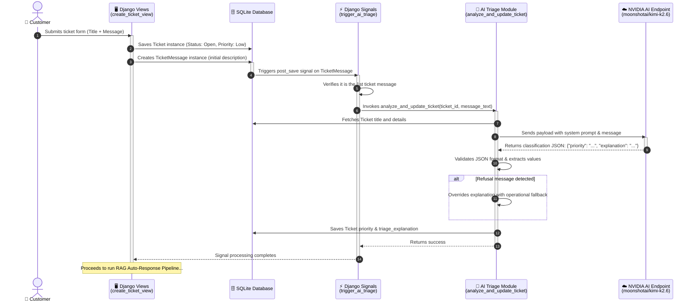
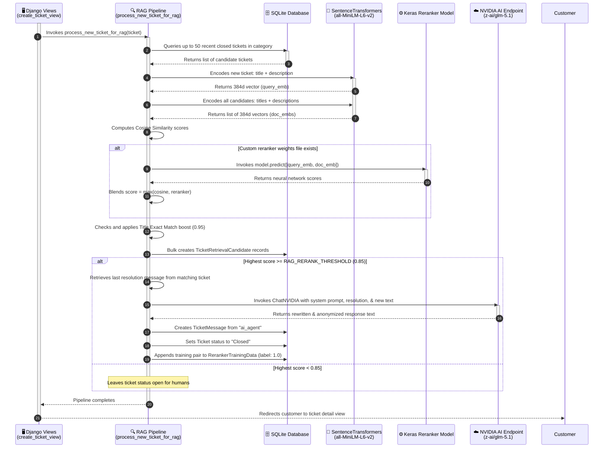
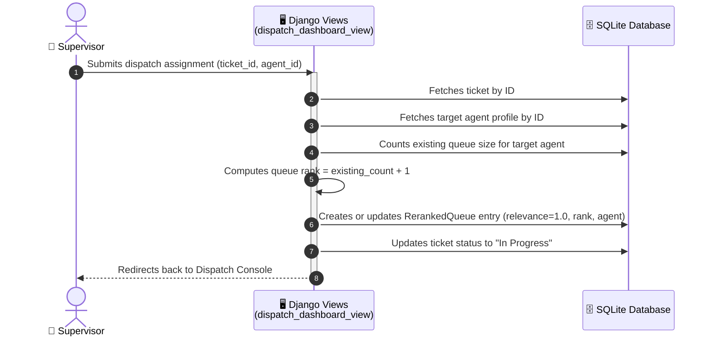
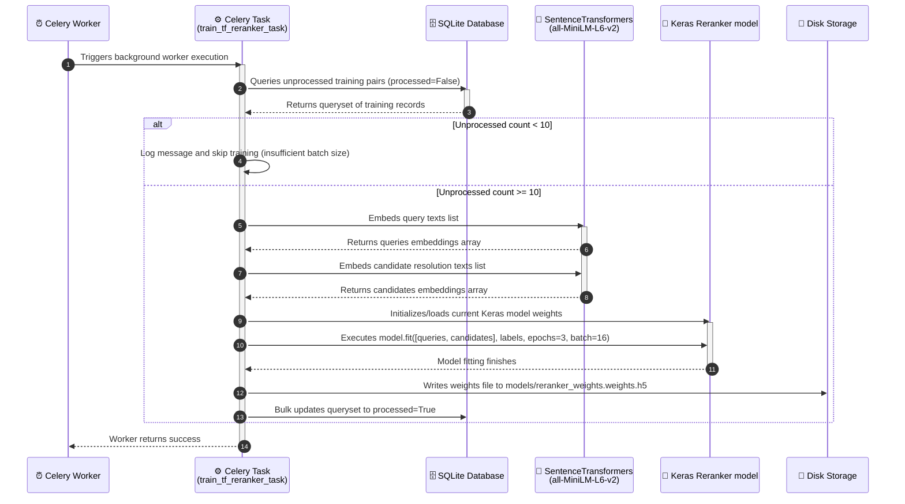

# Sequence Diagrams for Ticketing System

This document contains detailed **Mermaid sequence diagrams** representing the step-by-step logic, function calls, and interactions of all system processes.

---

## 👥 1. Ticket Creation & AI Triage Process (Synchronous)

This diagram shows the flow when a customer submits a new ticket. It illustrates how the initial message is created, which immediately triggers the Django post-save signal to run the AI Triage classification.



---

## 🔍 2. RAG Pipeline & Auto-Response Process (Synchronous)

Directly following AI Triage, the view initiates the RAG pipeline. This diagram maps how historical candidate tickets are loaded, embedded, scored via the custom Keras Reranker, and used to auto-resolve a ticket if relevance meets the threshold.



---

## 👑 3. Supervisor Dispatch System (Synchronous)

This diagram shows how a supervisor views, updates, and assigns tickets to human agents, establishing the queue entry structure.



---

## 💬 4. Agent/Customer Message Interactions & Status Management (Synchronous)

This diagram highlights the smart status management flow when messages are exchanged between agents and customers inside a ticket conversation thread.

    ```mermaid
    sequenceDiagram
        autonumber
        actor User as 👤 Customer / Agent
        participant Views as 🖥️ Django Views<br/>(ticket_detail_view)
        participant DB as 🗄️ SQLite Database

        User->>Views: Posts new reply message (POST request)
        activate Views
        Views->>DB: Verifies user permissions to view thread
        
        Views->>DB: Creates TicketMessage record
        
        alt Sender is Customer AND ticket status is Closed
            Views->>DB: Sets ticket status to "Open"
            Note over Views, DB: Re-opens ticket for agent attention
        else Sender is Agent/Supervisor AND ticket status is Open
            Views->>DB: Sets ticket status to "In Progress"
            Note over Views, DB: Moves ticket into agent workspace loop
        end
        
        Views-->>User: Redirects back to refresh details thread
        deactivate Views
```

---

## ⚙️ 5. Reranker Retraining Task (Asynchronous Celery)

This diagram maps the offline neural network training sequence triggered by background workers, showing how training data batches are compiled and fitted.


