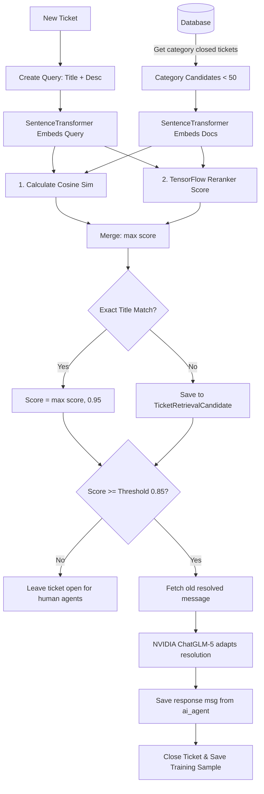

# AI Subsystems: Triage & RAG Reranker

This document provides a detailed technical breakdown of the two artificial intelligence subsystems driving the **Intelligent Ticketing System**: the **AI Triage System** and the **Retrieval-Augmented Generation (RAG) Auto-Response Pipeline**.

---

## 🤖 1. AI Triage System (`ticketing_system/ai_triage.py`)

The Triage System automatically classifies incoming tickets and assigns them a priority level (**Low**, **Medium**, or **High**) along with a brief explanation.

### ⚡ Execution Trigger
* **Django Signal**: Listens to the `post_save` signal on the `TicketMessage` model ([signals.py](file:///c:/Users/lenovo/Desktop/amine-project/amineproject/ticketing_system/signals.py)).
* **Condition**: Runs only when the ticket's message count is exactly `1` (which corresponds to the customer's initial description when opening the ticket).
* **Core Entrypoint**: `analyze_and_update_ticket(ticket_id, message_text)` ([ai_triage.py:L65](file:///c:/Users/lenovo/Desktop/amine-project/amineproject/ticketing_system/ai_triage.py#L65)).

### 🧠 Model & Classifier
* **LLM Model**: Hosted `moonshotai/kimi-k2.6` accessed via LangChain's `ChatNVIDIA` endpoint wrapper.
* **Temperature**: `0` (for high-consistency classification).
* **System Prompt Rules**:
  * **High**: System down, database offline, ransomware/breach, or core business flow completely blocked with zero workarounds.
  * **Medium**: Broken core features with workarounds, degraded performance, remote access/VPN failures.
  * **Low**: Configuration advice, general questions, minor UI bugs, single-user minor impacts.

### 🛡️ Parsing, Validation, and Safety Guards
1. **JSON Extraction**: The LLM output is stripped of markdown code blocks (` ```json `) and parsed to find the dictionary matching `{...}` ([ai_triage.py:L40](file:///c:/Users/lenovo/Desktop/amine-project/amineproject/ticketing_system/ai_triage.py#L40)).
2. **Pydantic Validation**: Validated against the `TicketAnalysis` schema:
   ```python
   class TicketAnalysis(BaseModel):
       priority: str = Field(description="Must be 'Low', 'Medium', or 'High'")
       explanation: str = Field(description="Brief justification sentence")
   ```
3. **Refusal Phrase Filter**: If the LLM generates a refusal message (e.g. "I cannot help bypass security" or "against policy"), the `_looks_like_refusal` helper ([ai_triage.py:L35](file:///c:/Users/lenovo/Desktop/amine-project/amineproject/ticketing_system/ai_triage.py#L35)) intercepts the response and overrides it with a professional operational description, avoiding raw AI refusals on customer-facing tickets.
4. **Error Fallback**: If the JSON parser fails or client connections throw exceptions, the handler automatically catches the error and assigns a safe priority level (e.g. `Low` or `Medium`) with a standard fallback explanation to prevent blocking the ticket submission flow.

> [!WARNING]
> **Architectural Issue identified in `ai_triage.py`**:
> The instantiation of `llm = ChatNVIDIA(...)` is currently located **outside** the try-except safety block ([ai_triage.py:L72](file:///c:/Users/lenovo/Desktop/amine-project/amineproject/ticketing_system/ai_triage.py#L72)). If the developer's environment has a bad network connection or missing `NVIDIA_API_KEY`, initializing this client raises a connection exception immediately. Since it is unhandled during signal processing, it will crash ticket creation entirely. 
> **Recommendation**: Wrap the entire initialization block inside the `try-except` block to ensure failures degrade gracefully to standard default priorities.

---

## 🔍 2. RAG Auto-Response Pipeline (`ticketing_system/rag_pipeline.py`)

If a customer submits an issue that is identical or highly similar to a previously resolved ticket, the RAG pipeline automatically retrieves the old resolution, adapts it via an LLM, sends it as an auto-response, and closes the ticket.

### 🔄 Data Flow diagram


### 🧮 Embedding Generation
* **Model**: `SentenceTransformer('all-MiniLM-L6-v2')` ([rag_pipeline.py:L51](file:///c:/Users/lenovo/Desktop/amine-project/amineproject/ticketing_system/rag_pipeline.py#L51)).
* **Embeddings size**: 384 dimensions.
* **Content Embedded**: `"{title}\n{first_message_body}"`.

### ⚙️ Custom TensorFlow / Keras Reranker
If a pre-trained weights file (`models/reranker_weights.weights.h5`) exists on the filesystem, the pipeline incorporates the Keras model.
* **Network Structure**:
  * **Inputs**: Query embedding vector (384) + Candidate embedding vector (384).
  * **Concatenate**: Merges the two vectors into a 768-dimensional vector ([rag_pipeline.py:L57](file:///c:/Users/lenovo/Desktop/amine-project/amineproject/ticketing_system/rag_pipeline.py#L57)).
  * **Dense Layer 1**: 128 units, ReLU activation.
  * **Dense Layer 2**: 64 units, ReLU activation.
  * **Output Layer**: 1 unit, Sigmoid activation, representing relevance probability (`0.0` to `1.0`).
* **Score Fusion**: The candidate score is computed as `max(keras_score, cosine_similarity)`.
* **Exact Match Override**: If the new ticket's title is identical to a candidate's title (case-insensitive), the score is boosted to at least `0.95` (`EXACT_TITLE_MATCH_SCORE`).

### 💬 LLM Generation & Safeguards (`z-ai/glm-5.1`)
When a candidate matches above the threshold (configured in `settings.py` as `RAG_RERANK_THRESHOLD = 0.85`):
1. **Resolution Extraction**: Extracts the closing message of the old ticket ([rag_pipeline.py:L17](file:///c:/Users/lenovo/Desktop/amine-project/amineproject/ticketing_system/rag_pipeline.py#L17)). It prioritizes **Human Agents** (Agent or Supervisor) and only falls back to an `AI_Agent` message if no human participated.
2. **Generative Prompt**: Invokes `z-ai/glm-5.1` with a detailed system prompt instructing it to:
   * **Reformulate & Adapt**: Rewrite the resolution to fit the new user's specific text.
   * **Anonymize Data**: Strip names, IP addresses, dates, order IDs, and ticket keys.
   * **Zero Meta-Commentary**: Never state "Based on previous ticket #...". Talk directly and empathetically to the user.
3. **Response Generation**: Creates a response from the `ai_agent` user, flags the ticket status to `Closed`, and records the successful match in `RerankerTrainingData` for future model tuning.
4. **Fallback Guard**: If the NVIDIA API is offline during RAG generation, the system returns a safe pre-formatted reply:
   > "Hello! We found a closely related ticket in our knowledge base. Here is how it was handled previously: [Historical Resolution]. Please review this guidance..."
