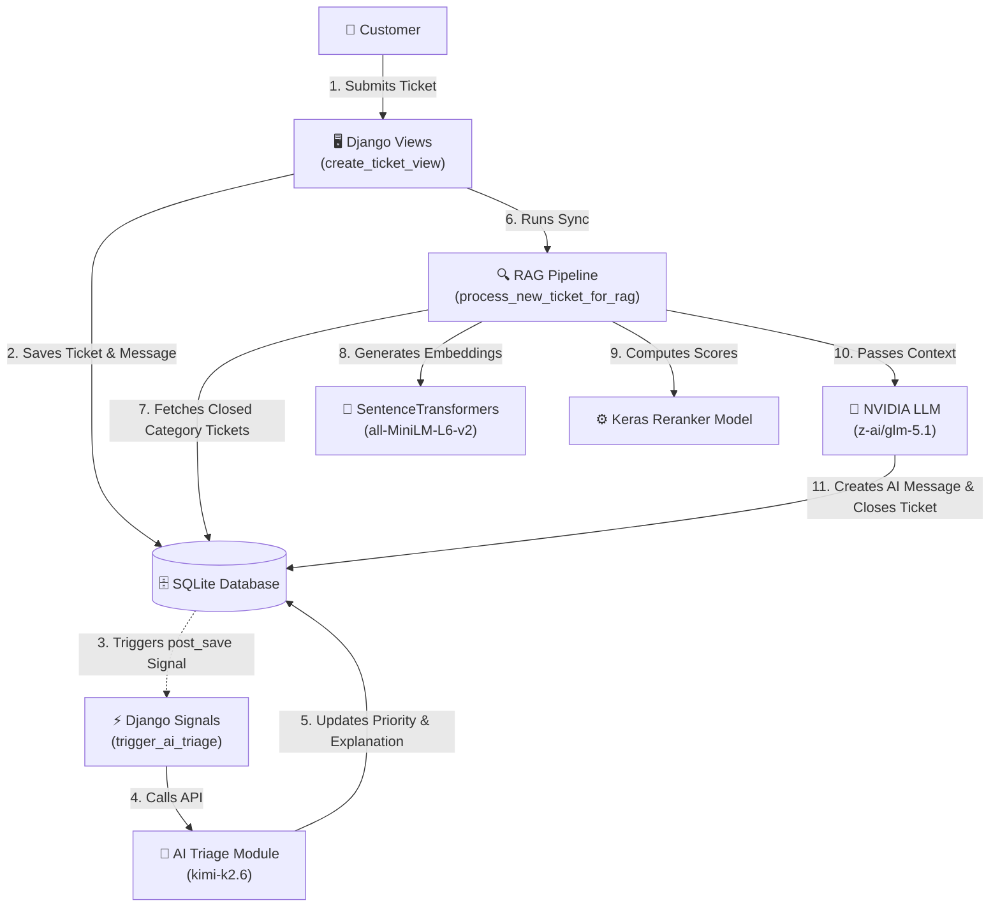

# System Architecture & Tech Stack

This document details the high-level system architecture, the module hierarchy, the technical dependencies, and the interaction flows of the **Intelligent Ticketing System**.

---

## 🏗️ Architectural Overview

The Intelligent Ticketing System is a web-based customer support platform built on the **Django** framework. It leverages a modern hybrid architecture combining relational database access and two integrated artificial intelligence subsystems:
1. **AI Triage System**: Automatically classifies incoming tickets into priority tiers based on operational and business impact.
2. **RAG Auto-Response Pipeline**: Employs vector embeddings and a custom **TensorFlow/Keras** reranker to retrieve past resolutions and generate replies via a Large Language Model (LLM).

*(Note: Celery is configured in the codebase but remains an inactive placeholder. All execution flows currently run synchronously inside Django's request-response cycle).*



---

## 💻 Tech Stack & Core Libraries

* **Web Framework**: [Django 6.0.5](file:///c:/Users/lenovo/Desktop/amine-project/amineproject/amineproject/settings.py) — Handles routing, user authentication, models, and administrative dashboards.
* **Embeddings Engine**: [SentenceTransformers 5.5.1](file:///c:/Users/lenovo/Desktop/amine-project/amineproject/ticketing_system/rag_pipeline.py#L4) — Generates dense vector representations (384 dimensions) using the `all-MiniLM-L6-v2` model.
* **Deep Learning Reranker**: [TensorFlow/Keras 2.21 / 3.14](file:///c:/Users/lenovo/Desktop/amine-project/amineproject/ticketing_system/rag_pipeline.py#L3) — A custom binary classifier model trained on ticket query-candidate pairs.
* **Orchestration & Chains**: [LangChain Core 1.4.0 / LangChain Community 0.4.2](file:///c:/Users/lenovo/Desktop/amine-project/amineproject/ticketing_system/ai_triage.py#L5-L6) — Coordinates prompt templates and chats with external model endpoints.
* **External LLM Gateways**: [langchain-nvidia-ai-endpoints](file:///c:/Users/lenovo/Desktop/amine-project/amineproject/ticketing_system/ai_triage.py#L6) — Accesses hosted models:
  * **Triage Classifier**: `moonshotai/kimi-k2.6`
  * **RAG Generator**: `z-ai/glm-5.1`
* **Asynchronous Queue (Placeholder)**: [Celery 5.6.3](file:///c:/Users/lenovo/Desktop/amine-project/amineproject/amineproject/celery.py) — Task signatures and settings are defined, but the queue is not loaded on Django startup or integrated into views/signals. All operations currently execute synchronously.

---

## 📁 Project Directory Structure

```text
amineproject/
├── .env                          # Local environment variables (API keys, settings)
├── manage.py                     # Django management script
├── requirements.txt              # Project package requirements
├── ticket.py                     # Historical CSV data import script
├── test_rag.py                   # RAG end-to-end simulation test script
├── db.sqlite3                    # Database storage
│
├── amineproject/                 # Main Configuration App
│   ├── __init__.py
│   ├── celery.py                 # Celery app initialization (inactive)
│   ├── settings.py               # Django configuration file (contains Celery configuration)
│   ├── urls.py                   # Main project url routing
│   └── wsgi.py / asgi.py
│
├── UserProfile/                  # User Profile App (Role & Capacity Management)
│   ├── models.py                 # UserProfile model defining Customer/Agent/Supervisor roles
│   ├── signals.py                # Automatic profile instantiation signal
│   └── views.py                  # Frontpage index view
│
├── ticketing_system/             # Core Business Logic App
│   ├── models.py                 # Ticket, Message, Queue, and Training schemas
│   ├── views.py                  # Dashboards, dispatch console, agent workspace views
│   ├── urls.py                   # Ticketing endpoints routing
│   ├── signals.py                # Post-save ticket message listener (AI Triage trigger)
│   ├── ai_triage.py              # IT Triage classification module
│   ├── rag_pipeline.py           # RAG retrieval & TensorFlow reranking pipeline
│   ├── tasks.py                  # Celery shared task queue definitions (placeholder)
│   └── tests.py                  # Unit and integration test suite
│
├── Templates/                    # HTML Templates
│   ├── index.html                # Welcome index page
│   ├── Agents/                   # Dispatch dashboard & Agent workspace
│   ├── Customer/                 # Ticket creation form, customer dashboard, details thread
│   └── registration/             # Built-in django login template
│
└── documentation/                # Project Documentation Folder
```

---

## ⚡ Integration Details & Execution Flows

### 1. The Ticket Submission & AI Triage Loop (Synchronous)
When a Customer submits a new support ticket via the UI:
1. `create_ticket_view` validates the form and saves a new `Ticket` instance.
2. A `TicketMessage` is saved with the initial issue description.
3. Django's `post_save` signal triggers `trigger_ai_triage`.
4. It calls `analyze_and_update_ticket`.
5. This function loads the prompt template, invokes `moonshotai/kimi-k2.6` using the NVIDIA endpoint, and requests a JSON response with `priority` and `explanation`.
6. The database ticket record is updated immediately.

### 2. The Retrieval-Augmented Auto-Response Loop (Synchronous)
Directly after triage completes:
1. `create_ticket_view` executes `process_new_ticket_for_rag` synchronously.
2. The pipeline queries up to 50 closed tickets in the **same category** from the database.
3. `SentenceTransformers` embeds the current query text and candidate texts.
4. If a pre-trained Keras reranking model is available (`models/reranker_weights.weights.h5`), it computes reranked matching probabilities for query-candidate pairs. Otherwise, it defaults to standard cosine similarities.
5. If the highest relevance score meets or exceeds `RAG_RERANK_THRESHOLD` (default: `0.85`):
   * It retrieves the resolution message from the best matching historical ticket (preferring human replies).
   * It sends the issue text and resolution to `z-ai/glm-5.1` via the NVIDIA API to generate a rewritten, personalized, anonymized response.
   * It saves this reply as a `TicketMessage` from the `ai_agent` user, sets the status of the ticket to **Closed**, and saves the training sample to `RerankerTrainingData` (labeled `1.0`).
6. If the score is below the threshold, the ticket is left **Open** for human agents to process.
