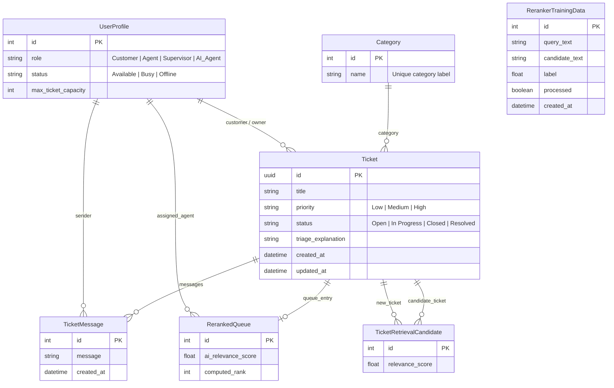

# Database Schema & Models

This document details the database schema, models, fields, and relationships defined in the **Intelligent Ticketing System** database.

---

## 🗄️ Database ERD (Entity-Relationship Diagram)

---

## 🧱 Model Reference

### 1. `UserProfile` (`UserProfile/models.py`)
Extends the standard Django `User` model using a one-to-one link to store application-specific roles and agent configurations.

| Field Name | Type | Options / Constraints | Description |
| :--- | :--- | :--- | :--- |
| `id` | Integer | Primary Key | Auto-incrementing identifier. |
| `user` | OneToOneField | `User`, `on_delete=models.CASCADE` | Link to Django's built-in authentication User. |
| `role` | CharField | `Customer`, `Agent`, `Supervisor`, `AI_Agent` | The user's system role. Defaults to `Customer`. |
| `status` | CharField | `Available`, `Busy`, `Offline` | Agent availability status. Defaults to `Offline`. |
| `max_ticket_capacity` | Integer | Default: `5` | Maximum number of tickets a human agent can handle. |

### 2. `Category` (`ticketing_system/models.py`)
Defines the classification bucket of a ticket (e.g., "Technical Support", "Payment Error").

| Field Name | Type | Options / Constraints | Description |
| :--- | :--- | :--- | :--- |
| `id` | Integer | Primary Key | Auto-incrementing identifier. |
| `name` | CharField | Max length: 100 | The name of the category. |

### 3. `Ticket` (`ticketing_system/models.py`)
Represents a customer support request.

| Field Name | Type | Options / Constraints | Description |
| :--- | :--- | :--- | :--- |
| `id` | UUIDField | Primary Key, `default=uuid.uuid4` | A secure, unguessable unique identifier. |
| `customer` | ForeignKey | `UserProfile`, `on_delete=models.CASCADE` | The customer who opened the ticket. |
| `title` | CharField | Max length: 100 | Brief summary of the customer's issue. |
| `category` | ForeignKey | `Category`, `on_delete=models.SET_NULL`, Nullable | Categorization of the ticket. |
| `priority` | CharField | `Low`, `Medium`, `High` | Urgency of the ticket. Defaults to `Low`. |
| `status` | CharField | `Open`, `In Progress`, `Closed`, `Resolved` | State of the ticket. Defaults to `Open`. |
| `triage_explanation` | TextField | Blankable | Explanation generated by AI Triage justifying the priority. |
| `created_at` | DateTimeField | `auto_now_add=True` | Timestamp when the ticket was created. |
| `updated_at` | DateTimeField | `auto_now=True` | Timestamp when the ticket was last updated. |

### 4. `TicketMessage` (`ticketing_system/models.py`)
Stores conversations or individual messages in a ticket's thread. Sorted chronologically.

| Field Name | Type | Options / Constraints | Description |
| :--- | :--- | :--- | :--- |
| `id` | Integer | Primary Key | Auto-incrementing identifier. |
| `ticket` | ForeignKey | `Ticket`, `on_delete=models.CASCADE` | The parent ticket thread. |
| `sender` | ForeignKey | `UserProfile`, `on_delete=models.SET_NULL`, Nullable | The user who sent the message (null for system notes). |
| `message` | TextField | None | Body content of the chat message. |
| `created_at` | DateTimeField | `auto_now_add=True` | Timestamp when the message was sent. |

### 5. `RerankedQueue` (`ticketing_system/models.py`)
Acts as the supervisor dispatch dashboard queue, mapping tickets to assigned human agents and ordering them by priority/rank.

| Field Name | Type | Options / Constraints | Description |
| :--- | :--- | :--- | :--- |
| `id` | Integer | Primary Key | Auto-incrementing identifier. |
| `ticket` | OneToOneField | `Ticket`, `on_delete=models.CASCADE` | The dispatched ticket. |
| `ai_relevance_score` | FloatField | None | Relevance score assigned to this ticket. |
| `computed_rank` | Integer | None | Order rank in the agent's workspace. |
| `target_agent` | ForeignKey | `UserProfile`, `on_delete=models.CASCADE` | The human agent assigned to solve this ticket. |

### 6. `TicketRetrievalCandidate` (`ticketing_system/models.py`)
Saves candidate scores generated during a RAG pipeline search, recording which old closed tickets were matched to a new ticket and with what relevance scores.

| Field Name | Type | Options / Constraints | Description |
| :--- | :--- | :--- | :--- |
| `id` | Integer | Primary Key | Auto-incrementing identifier. |
| `new_ticket` | ForeignKey | `Ticket`, `on_delete=models.CASCADE` | The incoming ticket being analyzed. |
| `candidate_ticket` | ForeignKey | `Ticket`, `on_delete=models.CASCADE` | A historical closed ticket considered for retrieval. |
| `relevance_score` | FloatField | Default: `0.0` | Computed match probability from embeddings/reranker. |

### 7. `RerankerTrainingData` (`ticketing_system/models.py`)
Stores positive training pairs (and placeholder negatives) used to offline-train the custom Keras reranker model.

| Field Name | Type | Options / Constraints | Description |
| :--- | :--- | :--- | :--- |
| `id` | Integer | Primary Key | Auto-incrementing identifier. |
| `query_text` | TextField | None | The input text (title + description) of the query. |
| `candidate_text` | TextField | None | The reference text (title + resolution) of the matching closed ticket. |
| `label` | FloatField | `1.0` (relevant), `0.0` (irrelevant) | The target classification score. |
| `processed` | BooleanField | Default: `False` | Flag tracking if this pair has been used for training. |
| `created_at` | DateTimeField | `auto_now_add=True` | Time the training pair was saved. |
