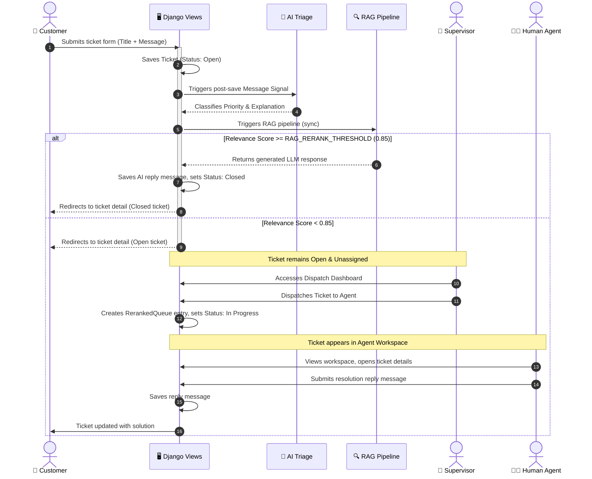

# User Roles & Workflows

This document details the role-based security model, access control logic, url routing, templates, and the end-to-end ticket lifecycle workflow of the **Intelligent Ticketing System**.

---

## 👥 Role Definitions & Security

The system implements role-based access control (RBAC) via the custom [UserProfile](file:///c:/Users/lenovo/Desktop/amine-project/amineproject/UserProfile/models.py) model. There are four distinct roles:

1. **Customer**: Can create support tickets, view their own ticket history dashboard, and reply to open conversation threads.
2. **Human Agent**: Solves tickets assigned to them by a supervisor. Has access to a dedicated personal workspace queue.
3. **Supervisor**: Manages ticket distribution. Can view all system tickets, monitor agent workloads, and dispatch tickets to available agents.
4. **AI System Agent**: An automated background agent (`username="ai_agent"`) that responds to tickets using historical knowledge bases.

---

## 🔒 Access Control Decorators

Django endpoints are secured using custom validation functions combined with `@login_required` and `@user_passes_test` decorators in [views.py](file:///c:/Users/lenovo/Desktop/amine-project/amineproject/ticketing_system/views.py):

* **`is_customer(user)`**: Restricts access to profiles with the `Customer` role (or superusers). Used on `/tickets/submit/` and `/tickets/dashboard/`.
* **`is_supervisor(user)`**: Restricts access to profiles with the `Supervisor` role (or superusers). Used on the dispatch dashboard `/tickets/dispatch/`.
* **`is_agent_or_above(user)`**: Restricts access to profiles with `Agent` or `Supervisor` roles (or superusers). Used on the agent workspace `/tickets/workspace/`.
* **Detail-Thread Security Check**: In `ticket_detail_view`, access is restricted to the **owner customer** or any **staff member** (Agent/Supervisor/Superuser). Any other user receives a `PermissionDenied` error.

---

## 🗺️ Views & Endpoints Map

| Endpoint URL | View Function | Required Role | Template | Description |
| :--- | :--- | :--- | :--- | :--- |
| `/` | `index` | Public / Any | `index.html` | Portal landing page. |
| `/tickets/submit/` | [create_ticket_view](file:///c:/Users/lenovo/Desktop/amine-project/amineproject/ticketing_system/views.py#L14) | Customer | `Customer/ticket_form.html` | Renders the ticket creation form and starts Triage + RAG. |
| `/tickets/dashboard/` | [ticket_dashboard_view](file:///c:/Users/lenovo/Desktop/amine-project/amineproject/ticketing_system/views.py#L49) | Customer | `Customer/dashboard.html` | Lists historical tickets opened by the logged-in customer. Supports search. |
| `/tickets/<uuid>/` | [ticket_detail_view](file:///c:/Users/lenovo/Desktop/amine-project/amineproject/ticketing_system/views.py#L65) | Owner / Staff | `Customer/ticket_detail.html` | Shows conversation messages. Handles replies. |
| `/tickets/dispatch/` | [dispatch_dashboard_view](file:///c:/Users/lenovo/Desktop/amine-project/amineproject/ticketing_system/views.py#L120) | Supervisor | `Agents/agent_dispatch.html` | Lists unassigned/assigned tickets and agent workloads; assigns tickets to agents. |
| `/tickets/workspace/` | [agent_workspace_view](file:///c:/Users/lenovo/Desktop/amine-project/amineproject/ticketing_system/views.py#L169) | Agent / Staff | `Agents/agent_workspace.html` | Workspace displaying tickets dispatched to the logged-in agent, sorted by rank. |
| `/accounts/login/` | Built-in | Public | `registration/login.html` | Handles system authentication. |

---

## 🔄 End-to-End Ticket Lifecycle Workflow

The chart below shows the sequence of events from ticket creation to final resolution:

### 📈 Smart Status Transitions
To keep workflows streamlined, the status transitions are managed automatically inside [ticket_detail_view](file:///c:/Users/lenovo/Desktop/amine-project/amineproject/ticketing_system/views.py#L89-L99):
* **Customer Reply**: If a Customer posts a reply on a `Closed` ticket, the ticket status is automatically reset to `Open` so that agents are prompted to look at it.
* **Agent Reply**: If an Agent or Supervisor posts a reply on an `Open` ticket, the ticket status is automatically transitioned to `In Progress` to indicate active troubleshooting.
